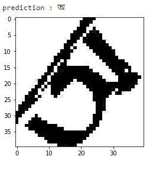

# Bangla Handwritten Letter Recognition using CNN

## Overview
This project implements a Convolutional Neural Network (CNN) to recognize Bangla handwritten characters. It involves training a deep learning model, making predictions, and integrating a GUI for character drawing.

## Requirements
- Python
- TensorFlow/Keras
- Google Colab (for training on GPU)
- PIL (Pillow)
- Tkinter (for GUI)

## Model Architecture
The model consists of:
- **Convolutional Layers**: Extract features from images.
- **MaxPooling Layers**: Reduce feature map size.
- **Dropout Layers**: Prevent overfitting.
- **Dense Layers**: Fully connected layers for classification.

```python
from keras.models import Sequential
from keras.layers import Conv2D, MaxPooling2D, Flatten, Dense, Dropout

classifier = Sequential()

classifier.add(Conv2D(filters=128, kernel_size=(3, 3), activation='relu', input_shape=(40, 40, 3)))
classifier.add(MaxPooling2D(pool_size=(2, 2)))
classifier.add(Dropout(0.2))

classifier.add(Conv2D(filters=64, kernel_size=(3, 3), activation='relu'))
classifier.add(MaxPooling2D(pool_size=(2, 2)))
classifier.add(Dropout(0.2))

classifier.add(Flatten())
classifier.add(Dense(units=128, activation='relu'))
classifier.add(Dropout(0.2))
classifier.add(Dense(units=50, activation='softmax'))

classifier.compile(optimizer='adam', loss='categorical_crossentropy', metrics=['accuracy'])
```

## Data Preparation
Images are loaded and preprocessed using `ImageDataGenerator`.
```python
from keras.preprocessing.image import ImageDataGenerator
train_datagen = ImageDataGenerator(rescale=1./255, shear_range=0.2, rotation_range=25)
test_datagen = ImageDataGenerator(rescale=1./255)

training_set = train_datagen.flow_from_directory('Dataset/Train', target_size=(40, 40), batch_size=32, class_mode='categorical')
test_set = test_datagen.flow_from_directory('Dataset/Test', target_size=(40, 40), batch_size=32, class_mode='categorical')
```

## Training the Model
```python
classifier.fit(training_set, epochs=10, validation_data=test_set, validation_steps=3000)
```

## Saving the Model
```python
classifier_json = classifier.to_json()
with open("CNN_BanglaHandWrittenCharacterRecognition.json", "w") as json_file:
    json_file.write(classifier_json)

classifier.save_weights("CNN_BanglaHandWrittenCharacterRecognition.h5")
```

## GUI for Character Drawing
A Tkinter-based GUI allows users to draw characters, which are then classified by the model.
```python
from tkinter import *
def create_new_image():
    root = Tk()
    cv = Canvas(root, width=256, height=256, bg='white')
    cv.pack()
    root.mainloop()
```

## Sample Output
Below is a sample output image demonstrating character recognition.



## Conclusion
This project successfully classifies handwritten Bangla characters using CNN and provides a GUI for real-time testing.
